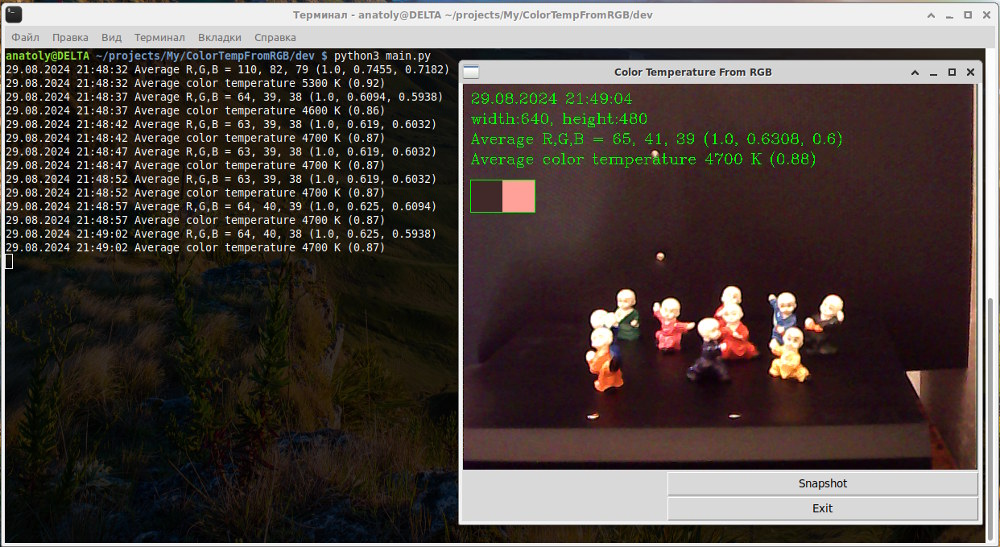
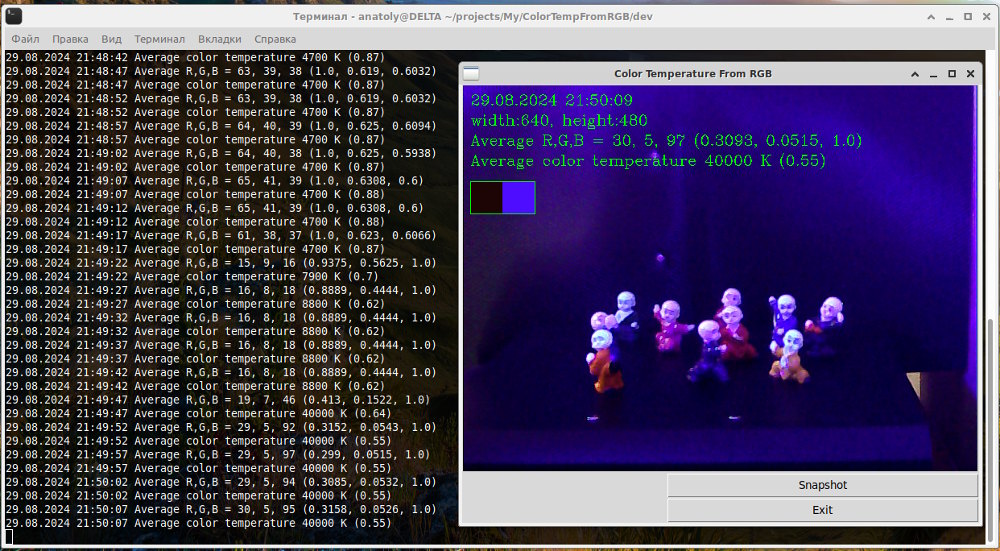
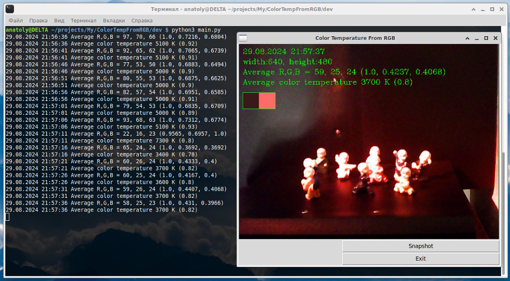

# ColorTempFromRGB - Calculate average color temperature.

Homepage: https://github.com/greentracery/ColorTempFromRGB
    
## Requirements:
    
    - Python >= 3.6

    - Pillow
    
    - Numpy
    
    - OpenCV (v.3.2 - 4.8;  v.4.10 doesn't work yet

## Usage:
    
```shell
    [python3] main.py [-url="rtsp://url_of_stream_source"] [-file="file_source"] [-ci=0] [-p=10] [-q=90] [-m=median|mean] [-log="logfile"]
```

Screenshots:

- Normal lightning, ~5000 К:



- UV-lamp, ~ 8000-40000 K (camera w/o UV-filter):



- Red lamp , ~ 3700 K:


